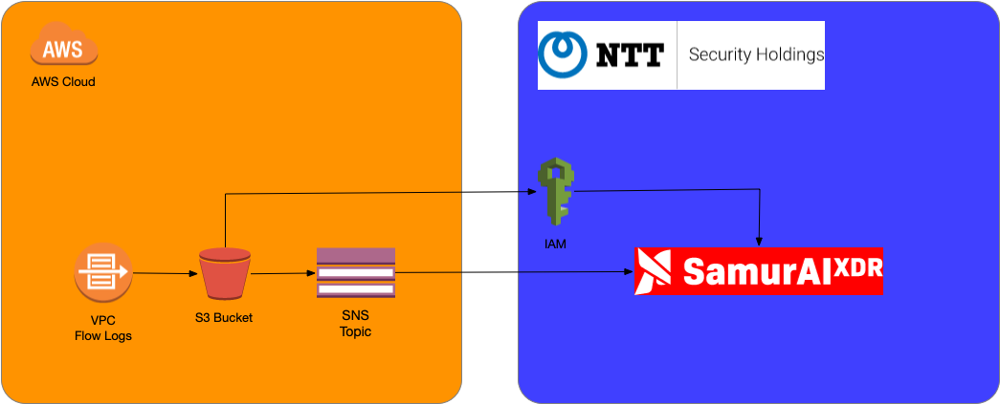

#NTT Samurai XDR S3 Integration


Main Samurai Template to allow object collection for Samurai XDR collection.
Create a Ingetragions in your SamuraiXDR Portal and retrieve the Integrations Id and Pass Key. 

## Creates the following Resources
* SNS Topic
* S3 Bucket with SNS Notification of ObjectCreated Events
* Secure Bucket Policy, Allowing SamuraiXDR RO access
* SNS HTTPS Webhook Subscription to the SamuraiXDR Platform. 

## Required Parameters
* IntegrationsId: from the Samurai Portal
* Passkey: from the Samurai Portal
* S3DataRetention: Automatically deletes objects after x number of days. Default 7, max 365


[](https://console.aws.amazon.com/cloudformation/home#/stacks/new?stackName=NTTSamuraiS3Stack&templateURL=https://samurai-cft-templates.s3.eu-central-1.amazonaws.com/prod/samurai-cft.yaml)

# vpc-flow-logs.yaml
Creates VPC Flow logs and sets the destination to the Samurai S3 Bucket created in the samurai-cft.yaml template. 

[](https://console.aws.amazon.com/cloudformation/home#/stacks/new?stackName=NTTSamuraiVPCLogs&templateURL=https://samurai-cft-templates.s3.eu-central-1.amazonaws.com/prod/vpc-flow-logs.yaml)
## Creates the following Resources
* VPC Flowlog for single VPC. 

## Required Parameters
* vpcId: The VPC ID of the VPC you want to receive flow logs from. 

## AWS KMS (Optional)
If a KMS Key is used to encrypted the S3 Objects in the Samurai S3 Bucket, the following needs to be added to the KMS Key Policy.
This allows the Samurai to use the key to decrypt the data on ingest.   
```json
{
    "Sid": "Allow NTTHS SamuraiXdr account to use this KMS key",
    "Effect": "Allow",
    "Principal": {
        "AWS": "arn:aws:iam::600502389717:root"
    },
    "Action": [
        "kms:Decrypt",
        "kms:ReEncrypt*",
        "kms:GenerateDataKey*",
        "kms:DescribeKey"
    ],
    "Resource": "*"
}
```

---


